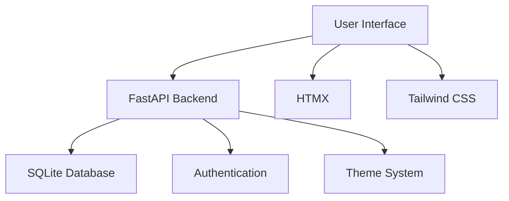
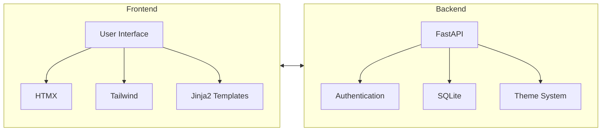
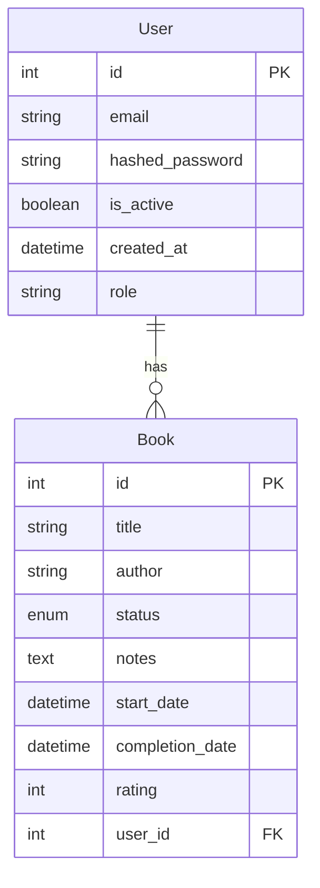
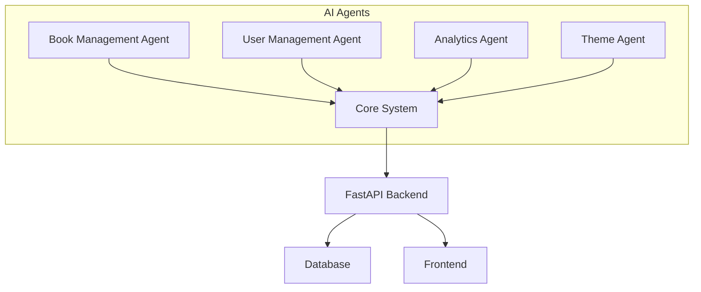

# Book Tracker AI Rebuild Plan

This document outlines the plan for rebuilding the Book Tracker application with AI agents.

## 1. Application Overview

The Book Tracker is a modern, mobile-friendly web application that helps users manage their reading life. It's built with:
- Backend: FastAPI + SQLite
- Frontend: HTMX + Tailwind CSS
- Templates: Jinja2

## 2. Technical Architecture

Current architecture:

## 3. Core Features

1. User Management
   - Registration/Login system
   - JWT-based authentication
   - User roles (admin/regular)

2. Book Management
   - Add/Edit/Delete books
   - Track reading status:
     * To Read
     * Currently Reading
     * Completed
     * On Hold
     * Did Not Finish (DNF)
   - Book metadata:
     * Title
     * Author
     * Notes
     * Start/Completion dates
     * Rating system (0-3)

3. Admin Features
   - User management
   - System statistics
   - Book usage analytics

4. Theme System
   - Multiple theme support
   - Theme persistence
   - Real-time theme switching

## 4. Data Model

## 5. Proposed AI Agent Architecture

For rebuilding with AI agents, we'll split the system into these specialized agents:

### Agent Responsibilities

1. Book Management Agent
   - Book CRUD operations
   - Reading status management
   - Progress tracking
   - Book recommendations
   - Integration with external book APIs
   - Smart categorization and tagging
   - Reading time estimation
   - Similar book suggestions

2. User Management Agent
   - Authentication/Authorization
   - User preferences
   - Profile management
   - Session handling
   - Reading habit analysis
   - Personalized recommendations
   - Social features coordination
   - Privacy management

3. Analytics Agent
   - Reading statistics
   - User behavior analysis
   - System metrics
   - Performance monitoring
   - Reading trend analysis
   - User engagement metrics
   - Book popularity tracking
   - Reading goal progress

4. Theme Agent
   - Theme management
   - UI customization
   - Accessibility features
   - Dynamic styling
   - Color scheme optimization
   - Dark/Light mode handling
   - Font optimization
   - Responsive design coordination

## 6. Implementation Strategy

### Phase 1: Core System Setup
1. Set up base FastAPI application
2. Implement database models
3. Create basic API endpoints
4. Set up authentication system

### Phase 2: AI Agent Integration
1. Implement agent communication system
2. Deploy individual agents
3. Set up agent coordination
4. Implement fallback mechanisms

### Phase 3: Frontend Development
1. Create responsive UI
2. Implement HTMX interactions
3. Set up theme system
4. Build admin interface

### Phase 4: Testing and Optimization
1. Unit testing
2. Integration testing
3. Performance optimization
4. Security auditing

## 7. Future Enhancements

1. Machine Learning Features
   - Reading time prediction
   - Book recommendations
   - User behavior analysis
   - Content categorization

2. Social Features
   - Reading groups
   - Book discussions
   - Shared reading lists
   - Reading challenges

3. Integration Options
   - Goodreads API
   - Google Books API
   - Library systems
   - E-reader sync

4. Advanced Analytics
   - Reading patterns
   - Genre preferences
   - Reading speed tracking
   - Goal achievement analysis